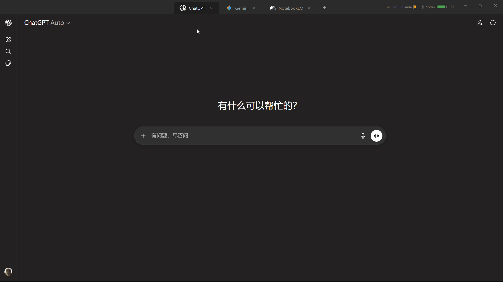

# AIHub

一个基于 Electron 的桌面 AI 聚合工具，把 ChatGPT、Gemini、NotebookLM、Claude 和 Codex 放进同一个窗口里，方便统一切换、保持登录状态，并在顶部直接查看部分服务的用量信息。



## 项目特点

- 单窗口聚合多个 AI 服务，减少浏览器窗口和标签页切换成本
- 默认内置 `ChatGPT`、`Gemini`、`NotebookLM` 三个标签页
- 通过 `+` 按钮可继续添加 `Claude` 和 `Codex`
- 标签页支持关闭、拖拽排序、`Ctrl+Tab` / `Ctrl+Shift+Tab` 快速切换
- 每个服务使用独立 `partition="persist:xxx"`，尽量保持各自登录会话
- 自定义右键菜单，支持复制、粘贴、剪切、全选、刷新、复制当前 URL
- 顶部显示 Claude / Codex 用量电池条，并支持手动刷新
- 顶部显示应用内存占用，便于观察多 `webview` 带来的资源消耗
- 对非首屏页面做了懒加载，并启用了部分 Electron GPU 渲染优化

## 技术栈

- Electron
- HTML / CSS / 原生 JavaScript
- Electron `webview`
- Windows PowerShell / WMI（用于内存占用读取）

## 项目结构

```text
AIHub/
├─ index.html             # 主界面、样式、标签逻辑、右键菜单、用量抓取
├─ main.js                # Electron 主进程、窗口配置、IPC、内存查询
├─ package.json
├─ icon-256.png
├─ AIHub演示效果.gif
└─ AIHub-开发记录.md
```

## 主要功能

### 1. 多标签 AI 工作区

- 默认打开 ChatGPT、Gemini、NotebookLM
- Claude、Codex 改为按需添加，降低启动时内存占用
- 标签支持点击切换、关闭、拖拽重排

### 2. 快捷键切换

- `Ctrl+Tab` 切到下一个标签
- `Ctrl+Shift+Tab` 切到上一个标签

这个快捷键在主窗口和 `webview` 内都可用，主进程做了统一拦截。

### 3. 自定义右键菜单

支持以下操作：

- Copy
- Paste
- Cut
- Select All
- Reload
- Copy URL

### 4. Claude / Codex 用量显示

应用通过隐藏 `webview` 后台访问用量页面，并从页面内容中抓取剩余额度数据，显示为顶部电池条。

说明：

- Claude 用量页：`https://claude.ai/settings/usage`
- Codex 用量页：`https://chatgpt.com/codex/settings/usage`
- 抓取逻辑依赖目标页面 DOM / 文本结构，页面改版后可能需要调整

### 5. 内存占用监控

主进程通过 PowerShell 调用 WMI，读取 `WorkingSetPrivate` 来估算 AIHub 的私有工作集内存，并每 5 秒刷新一次。

## 运行方式

当前目录里的 `package.json` 只包含基础元信息，没有脚本和依赖定义。要在源码目录直接运行，至少需要先安装 Electron。

### 方式一：临时运行

```bash
npm install electron --save-dev
npx electron .
```

### 方式二：补充脚本后运行

你也可以自行给 `package.json` 增加脚本，例如：

```json
{
  "scripts": {
    "start": "electron ."
  }
}
```

然后执行：

```bash
npm install
npm start
```

## 使用说明

1. 启动应用后，默认进入 ChatGPT 标签页。
2. 点击顶部标签可切换不同服务。
3. 点击 `+` 可新增 Claude、Codex 或重复打开其他服务页。
4. 在网页内部右键会弹出自定义菜单。
5. 顶部右侧可查看：
   - 当前应用内存占用
   - Claude 用量状态
   - Codex 用量状态
6. 点击刷新按钮可重新抓取用量信息。

## 已知限制

- 仅在 Windows 场景下对内存监控做了明确适配
- 多 `webview` 架构天然比较吃内存
- 某些站点如果修改登录策略、Cookie 策略或页面结构，可能影响会话保持和用量抓取
- 当前项目是单文件前端结构，适合快速迭代，不适合复杂功能长期扩展

## 开发备注

- `index.html` 集成了大部分界面与交互逻辑
- `main.js` 负责窗口、快捷键拦截、右键操作转发和内存查询
- 更详细的演进过程可见 [AIHub-开发记录.md](C:/Users/Lzo/Desktop/AIHub/AIHub-开发记录.md)

## 适合的使用场景

- 同时使用多个 AI 工具进行检索、写作、代码辅助
- 想把常用 AI 服务集中在一个桌面窗口中
- 希望少开浏览器标签，同时保留各服务独立登录状态
